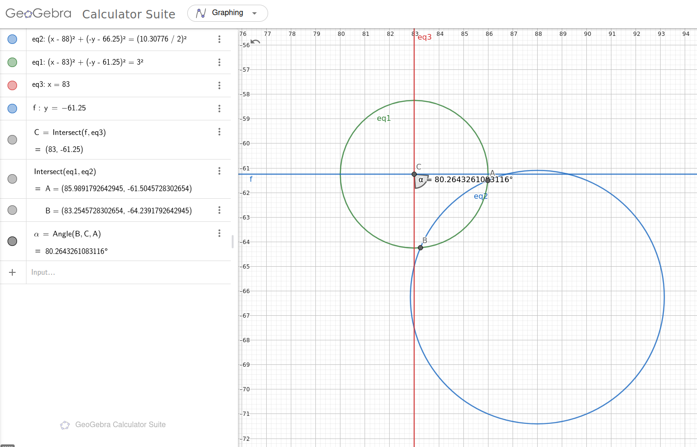

# Hardware

The PCB designs were created in KiCAD and the panels were made using KiKit.

The sensor board is designed to be as small as possible, for this reason some features of the BNO085 are no longer accessible.

## PCB Board Key

Some of the boards are keyed to give them a known orientation. This key was created by the intersection between the main PCB edge circle and another circle placed in the top right corner of the main circle's bounding box. This is outlined in the screenshot below (the y-axis has been inverted in Geogebra to visually match the KiCAD coordinate system).

